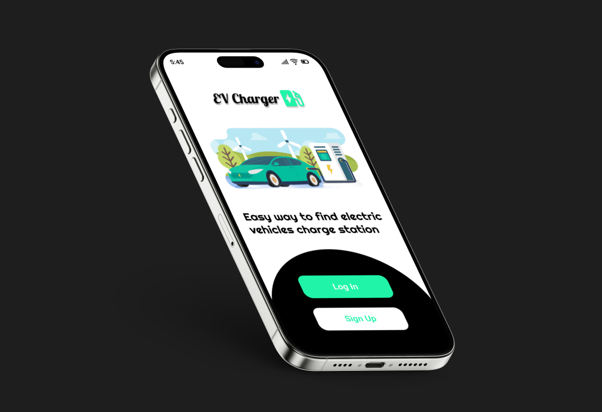
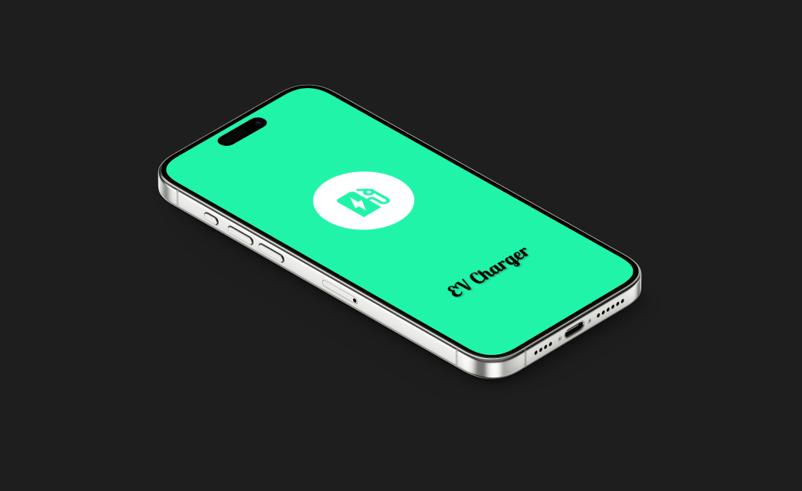
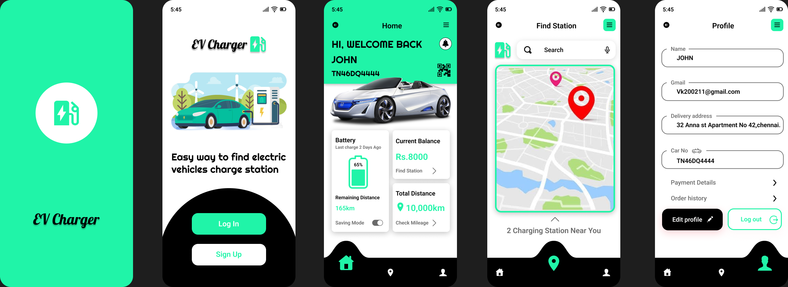

# 🚗 EV Charger Mobile App – UI/UX Design

A **modern EV charger mobile app UI/UX design** created with Figma, focusing on seamless user experience for locating charging stations and managing charging sessions.

---

## 🔹 About the Project
This project showcases **UI/UX design skills** for a mobile application emphasizing:  
- Clean, modern design  
- Intuitive navigation  
- User-friendly interactions  

The app allows users to discover charging stations, monitor charging sessions, and navigate effortlessly.

---

## ✨ Key Features
- ⚡ **Charger station discovery** – Find nearby EV chargers quickly  
- ⏱ **Charging status & progress** – Real-time monitoring  
- 🎨 **Clean & modern UI** – Visually appealing layouts  
- 🧭 **User-friendly navigation** – Easy to use for all audiences  
- 📱 **Mobile-first design** – Optimized for smartphones  

---

## 🛠 Tools & Technologies
- **Figma** – UI/UX Design  
- **Wireframing & Prototyping**  
- **Design Principles** – Accessibility, Clarity, Consistency  

---

## 📸 Screenshots

| Login | Home | Find Stations |
|-------|------|---------------|
|  |  |  |

| Profile | App Logo | Full App Design |
|---------|----------|----------------|
|  |  |  |

---

## 📂 Project Structure

